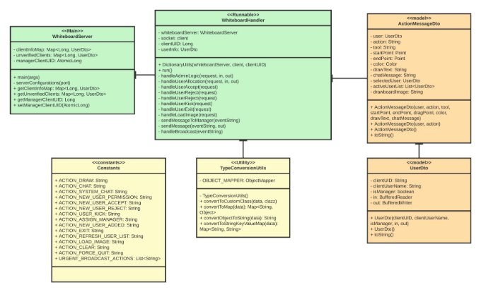
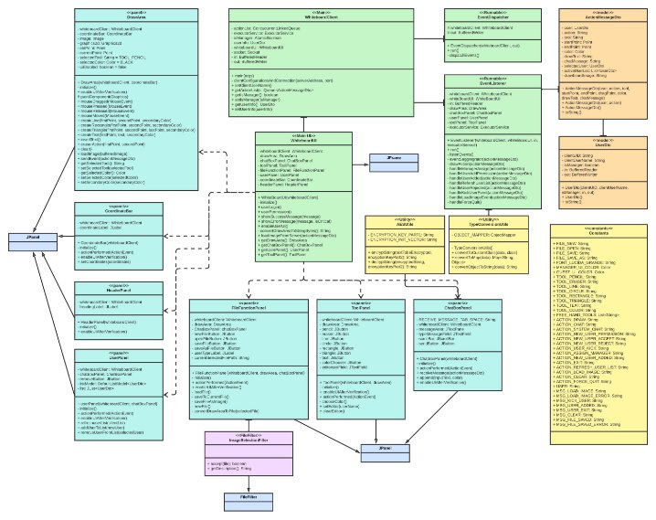
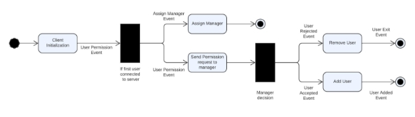
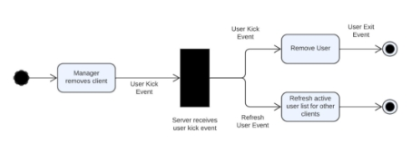
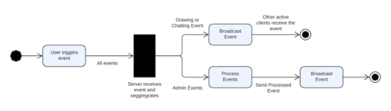
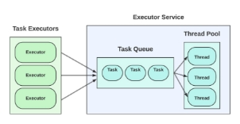
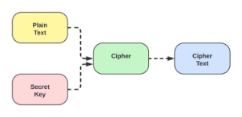

# SHARED WHITEBOARD

## Contents

- 1 Introduction
- 2 Problem Context
- 3 Server Architecture
   - 3.1 Whiteboard Server
   - 3.2 Whiteboard Server Functions
   - 3.3 Whiteboard Server Utilities
- 4 Client Architecture
   - 4.1 Whiteboard Client
   - 4.2 Listeners and Dispatchers
   - 4.3 Whiteboard Client UI
   - 4.4 Whiteboard Client Utilities
- 5 Application Flow
- 6 Critical Analysis of Components
   - 6.1 TCP Connection
   - 6.2 Thread Pool Worker
   - 6.3 Message Exchange (JSON & DTO)
   - 6.4 Track Active Clients & Events Triggered
   - 6.5 Security
   - 6.6 Logging Framework
   - 6.7 Maven Project Management
- 7 Further Improvements
- 8 Conclusion
- 9 User Interface Components
   - 1 Whiteboard Server Architecture List of Figures
   - 2 Whiteboard Client Architecture
   - 3 User Allocation Flow
   - 4 User Removal Flow
   - 5 Event Broadcast Flow
   - 6 Executor Service Initialization
   - 7 Executor Service Architecture
   - 8 String to DTO Transformation
   - 9 Java Concurrent Hash Map
   - 10 Java Concurrent Linked Queue
   - 11 High-Level AES Algorithm
   - 12 Whiteboard Client Interface


## 1 Introduction

The project implemented is related to a shared whiteboard that is capable of handling multiple
clients, in which they can perform basic drawing operations and send messages to the group. The
application uses a client-server architecture with a thread pool worker and user interface for clients.

## 2 Problem Context

The problem statement for this application is to create a shared whiteboard in which multiple clients
can draw simultaneously. They can use different tools such as free-hand drawing, erasing, drawing
different shapes like circles, triangles, and rectangles, and also input text into the drawing area.
The clients should also have the facility to chat with the group of clients connected and see the list
of active clients. Amongst the clients, one person will be the manager with the ability to perform
file operations like open files, save files, and new files. The manager should also have the ability to
remove users from the shared whiteboard and new clients joining should only be allowed once the
manager accepts the join request.

## 3 Server Architecture

### 3.1 Whiteboard Server

The server is initialized by running theWhiteboardServer.javafile. This is used to open a socket
on the port defined by the user and wait for client connections. The client connections are handled
by a thread pool. It keeps track of all the verified and unverified clients connected as well as the
client acting as the manager of the shared whiteboard.

### 3.2 Whiteboard Server Functions

We create a runnable interface,WhiteboardHandler.javafile which allows the server to maintain
a separate thread for each client connected. It handles various events triggered by both clients and
the manager. It allocates the first user connected as the manager and sends a user permission event
to the manager for any clients that join after that. It also handles administration tasks like client
exit, client removal, user acceptance, and rejection events from the manager. It has the capability
of sending direct messages as well as broadcast messages. All the draw and chat events triggered
by the clients go through the server and get broadcast to all the active clients. Multiple exception
scenarios have been handled in order to keep the whiteboard running smoothly.

### 3.3 Whiteboard Server Utilities

The server applications make use of several utility classes which have reusable code and help the main
code look cleaner and more understandable for further refactoring.TypeConversionutils.javafile
helps in converting the requests sent over the network to relevant DTOs for further use. The server
also makes use of frequently used constants by accessing theConstants.javafile.

```
Figure 1: Whiteboard Server Architecture
```
## 4 Client Architecture

### 4.1 Whiteboard Client

The whiteboard client is initialized by running theWhiteboardClient.javafile. It connects to the
server host address and port defined by the user at the start of the application. Once connected
to the server, it opens up an input and output stream with the server. It then assigns different
threads for receiving and sending events through the stream to the server. Additionally, this class
also keeps track of the user information and a concurrent queue for adding events to be sent to the
server. The client handles all types of exception related to incorrect startup and wrong usernames,
and displays them to the user for error reporting.

### 4.2 Listeners and Dispatchers

The whiteboard client keeps two threads running indefinitely for listening and dispatching events
from the server. TheEventDispatcher.java file implements therunnableinterface and is used
to dispatch events to the server. It runs in an infinite loop and keeps polling the action queue for
any events added by the client for dispatching. Once it finds an event in the queue, it converts
the event to a string and sends it to the server using the buffered writer through the socket. The
EventListener.java file implements therunnableinterface and is used to listen to the events
coming from the server using the buffered reader object. It runs in an infinite loop as well while
reading the input stream connected to the server for the events. Once it receives an event from


the server, it converts the message to relevant DTO and processes them by performing drawings,
adding messages to the chat-box, user removal, and loading images. We use separate threads to
handle receiving and listening so as to let multiple users work simultaneously on the whiteboard
and not hamper the user experience.

### 4.3 Whiteboard Client UI

The whiteboard client user interface is initialized by theWhiteBoardUI.javafile. The class itself
extendsJFramefor easier integration with other components. On startup, it displays a user login
dialog which takes the input of the display name from the user. The frame contains sevenJPanels,
which are used for different functionalities. TheHeaderPanel.javafile is used to display the
title of the user interface, which appends the user name once the user has been accepted. The
FileFunctionPanel.javafile is used to display the file function buttons which are only accessible
by the manager, it also displays the type of user using the whiteboard i.e manager or guest. The
ToolPanel.javafile is used to display buttons for tools that can be used for freehand drawing or
drawing shapes onto the whiteboard using different colors, it also displays the current editor of the
whiteboard. TheUserPanel.javafile is used to display the list of active clients connected to the
shared whiteboard, it also provides the remove button functionality to the manager to kick clients
from the whiteboard. TheDrawArea.javafile is used for providing a blank canvas to the clients
for drawing purposes. TheChatBoxPanel.javafile is used to display the chat history and provide
a text input field for users to type text and send using the send button. TheCoordinateBar.java
file is used to display the coordinates of the mouse pointer on the drawing area, it also has an exit
button for users to exit the whiteboard gracefully. Files for each component are kept separate so
that it is easier to add new components, debug issues, and refactor code in the future.

### 4.4 Whiteboard Client Utilities

The whiteboard client application uses utility classes for different kinds of operations such as process-
ing the events received by the server, holding constants, and encryption and decryption of messages.
For processing the events received by the server and converting them into relevant DTOs, theType-
ConversionUtils.javafile is used, it is also used for converting the DTOs back to strings to send
them over the network. TheAESUtils.javafile is used to encrypt and decrypt chat messages sent
over the network using the AES encryption algorithm with CBC variation. Constants.javafile
is used to hold constants that are used repeatedly in the code to reduce code duplication and keep
them in a single place for further refactoring.


```
Figure 2: Whiteboard Client Architecture
```
## 5 Application Flow

Firstly, a whiteboard server application is initiated which opens up a server socket on the provided
port. The server keeps the socket open and waits for client connections. Once the whiteboard client
is up and running, whiteboard clients are initiated. As soon as the server receives an incoming
client connection request, it assigns thread to a particular client for processing the client requests.
Once the client is initiated, it opens a dialog for the user to enter the username. As soon as the user
enters the username, a join request is sent to the server and the client is displayed a disabled UI of
the shared whiteboard. Once the server receives the user permission request, it assigns the first user
joining in as the manager, and the following user’s request is sent to the manager for approval and
the user information is kept on the unverified map so that the client does not receive any broadcast
events. If the manager accepts the join request, the new user’s UI is enabled and it receives the
latest image of the whiteboard for synchronization purposes. The other active clients also receive


the user added event and add the user to the active client list. All the drawing and chatting events
are sent from client to server, in turn, the server broadcasts all the events to active clients except the
user who sent them. The manager can load an image on the whiteboard from the local computer,
which in turn is sent over the network for other clients to load the same image. Once a user has
been removed from the whiteboard or exits the whiteboard, the client is notified and it sends an
exit event to the server for graceful closure of the application, which closes the sockets and returns
the assigned thread to the thread pool for future clients to connect. Lastly, if the manager exits
the application, it sends an exit message to the server and the server, in turn, sends the force quit
event to all clients since the manager has exited the application.


```
Figure 3: User Allocation Flow
```

```
Figure 4: User Removal Flow
```

```
Figure 5: Event Broadcast Flow
```

## 6 Critical Analysis of Components

### 6.1 TCP Connection

The whiteboard client-server architecture uses TCP for connection between the server and multiple
clients. This protocol was chosen because it requires a connection to transmit data which guarantees
the delivery of data from one connected application to other. Since each request sent by a whiteboard
client is important to acknowledge and respond to, guaranteed delivery is a huge advantage while
using TCP. Once data is sent from one node, it also guarantees the sequencing of the data which cuts
down on a lot of processing on both the server and the client-side. TCP also performs extensive
error checking and acknowledgment of data which puts TCP over UDP in terms of reliability.
Lastly, Java has great support for TCP and it makes it easier to code and maintain for a small-scale
application like the shared whiteboard.

### 6.2 Thread Pool Worker

The shared whiteboard server uses a thread pool worker to assign threads to clients that connect to
the whiteboard server for maintaining separate connections and handling events triggered by them
parallelly. The whiteboard client also used a thread pool to assign different threads for listening
and dispatching events and executing other I/O blocking tasks. The thread pool architecture was
chosen for this application because if we add clients and receive a large number of requests we
may end up creating threads uncontrollably, which will ultimately lead to depletion of resources
and performance. The clients may generate or receive a huge number of events at any particular
time which might slow down the application. Thus, using this architecture helps save resources and
keeps the application running with some predefined limits. It also increases the performance of the
system scheduler that decides which thread gets access to resources next. In the application, we
make use of theExecutorServiceinterface for creating a thread pool. To fine-tune the thread pool
implementation we use theThreadPoolExecutor, which gives us a handle on the parameters like
corePoolSize,maximumPoolSize, andkeepAliveTime.


```
Figure 6: Executor Service Initialization
```

```
Figure 7: Executor Service Architecture
```


### 6.3 Message Exchange (JSON & DTO)

For exchanging requests and responses over the TCP network, the application makes use of JSON
format which is used for serializing and transmitting structured data over the network. This format
of message exchange was chosen as it creates a structured format that is also human-readable. It
is also easy to read and write this format to a java class which is known as DTO. The JSON
string received by the client and server is deserialized to theActionMessageDto.javafile and
UserDto.javafile by using the Jackson Object Mapper, which is a lightweight JSON library for
Java.


```
Figure 8: String to DTO Transformation
```
### 6.4 Track Active Clients & Events Triggered

The whiteboard server keeps a track of the active clients by storing the client’s information in
a concurrent map, to broadcast the events received by the server to other clients. It also stores
information about the unverified clients in a concurrent map to inform the unverified clients about
the acceptance or rejection from the manager. We use Java’sConcurrentHashMapwhich maintains
concurrency in a multi-threaded environment. The whiteboard client keeps a track of all the events
triggered by the client by storing them in a concurrent queue. It then fetches the events from
the queue and dispatches them to the server. We use Java’sConcurrentLinkedQueuefor achieving
concurrency since multiple threads might be adding or accessing the queue at the same time.


```
Figure 9: Java Concurrent Hash Map
```

```
Figure 10: Java Concurrent Linked Queue
```

### 6.5 Security

The whiteboard clients encrypt the chat messages sent over the network and then decrypt the
messages once received from other clients. The symmetric-key block cipher plays an important role
in data encryption. It means that the same key is used for both encryption and decryption. AES
is a widely used symmetric-key encryption algorithm, which is also used in this application. The
AES algorithm is an iterative, symmetric-key block cipher that supports cryptographic keys (secret
keys) of 128, 192, and 256 bits to encrypt and decrypt data in blocks of 128 bits. We use the CBC
variation of AES, which uses an IV to augment the encryption. First, CBC uses the plain-text
block XOR with the IV. Then it encrypts the result to the cipher-text block. In the next block, it
uses the encryption result to XOR with the plain-text block until the last block. This way we can
secure sensitive data being sent across the network.


```
Figure 11: High Level AES Algorithm
```
### 6.6 Logging Framework

The whiteboard application logs all the important information in the console in a structured manner.
The exceptions occurred during execution are handled and displayed with the time, thread, class
and the exception message itself. The important events received or sent by the client are also
logged to check correct working of the system. We use theLogback frameworkwhich offers faster
implementation and provides more configuration and flexibility.

### 6.7 Maven Project Management

Both the whiteboard server and client use a lot of external JARs for various functionalities defined
above. We use Maven as our project management tool which allows a project to centralize the
dependencies of externalJARs and use them freely in our application. We also use theMaven
Shade Plugin that helps package the application into an executableJAR which contains all the
dependencies so that it can be executed on any machine with a JVM.


## 7 Further Improvements

The application has a lot of basic drawing functionalities which can be improved by adding the
rubber-band effect, that allows a user to see the temporary image of the shape being created. We
can also provide the functionality of selection particular shapes and moving and resizing them.
In the whiteboard client instead of running two threads indefinitely we can make use of different
messaging frameworks likeApache Kafka - a pub-sub messaging system, which can allow us
to make application more streamlined and use fewer resources. As of now our server only detects
disconnections through graceful shutdowns of the client, we can implement a knock-knock server
that keeps checking the client connection state and works accordingly. The whiteboard server can
be improved by implementing SSL sockets to enhance the security of the data transferred over the
network. We can also provide the server the functionality to handle different sessions of whiteboard
with different managers.

## 8 Conclusion

In conclusion, we created a multi-threaded shared whiteboard application with a client-server archi-
tecture that uses a TCP connection. It can handle different types of events like drawing and chatting,
concurrently which allows users the experience of editing the same whiteboard with multiple clients.
We use thread pool workers to make efficient use of resources. We use concurrent maps and queues
for storing data that can be accessed by multiple threads to avoid deadlocks. We make use of JSON
for structured storage of data and message exchange. The whole application handles different kinds
of errors and reports them to the user with appropriate messages.

## 9 User Interface Components


```
Figure 12: Whiteboard Client Interface
```


